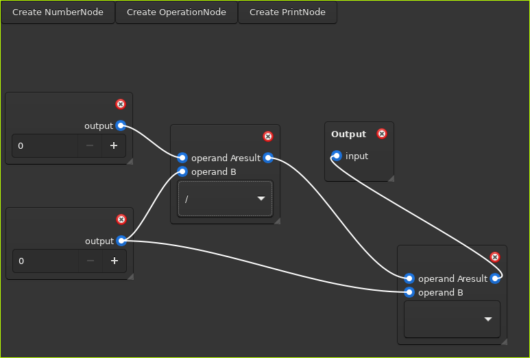
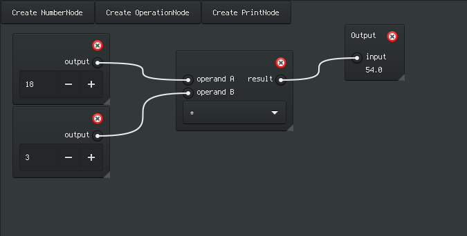
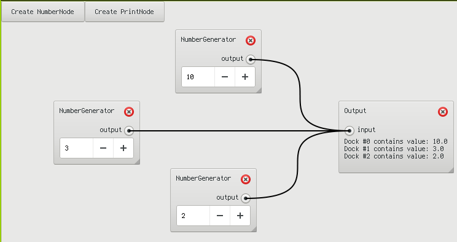
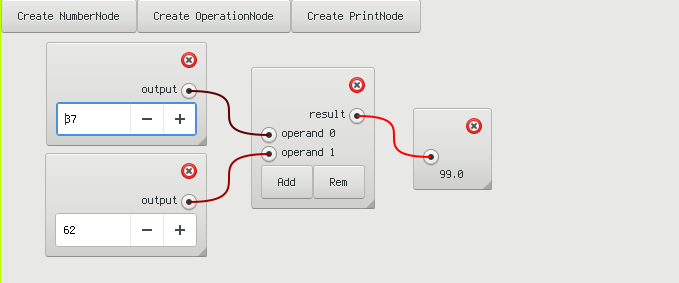
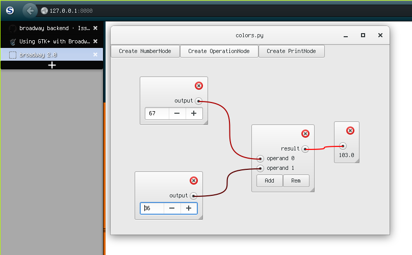
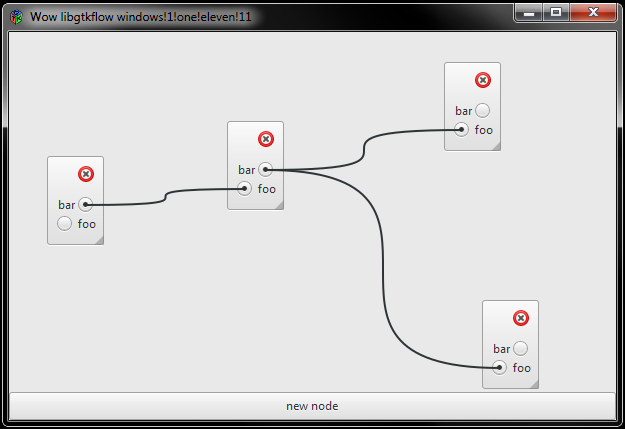

GtkFlow
=======

[](https://repology.org/project/libgtkflow/versions)

Here you see libgtkflow, a universal library for drawing flow graphs with
Gtk+ 3.

Flow graphs are a possibility to let your user model flows of data from, through
and into several stations.

Whenever you have to let your users model a process or have to display the topology
of a process to your users, flow graphs are the way to go.

Screenshots
-----------



GtkFlow has been optimized to provide much nicer visual cues on the direction of connections



Sinks and Sources may now appear on the same line



We now have Sinks that can receive data from multiple sources!



A more recent screenshot showing off libgtkflow with Gtk > 3.20. It looks
a bit clearer.



This is libgtkflow running inside firefox via broadway ↑



GtkFlow runs unter that strange M$-operating-system, too ↑

Motivation
----------

I love Flowgraphs in other programs and i want to have them in my favourite
UI-toolkit Gtk. I ran into some programs which implemented similar functionality
but they all didn't feel or even look very Gtk-like/GNOMEy.

Possible Usages
---------------

Specific:

  * Writing an UI for [GStreamer](http://gstreamer.org)
  * Writing an UI for [Beehive](https://github.com/muesli/beehive)
  * Replacement for the UI in [Gnuradio](http://gnuradio.org)
  * Matching monitors / inputs / outputs in [Pavucontrol](http://freedesktop.org/software/pulseaudio/pavucontrol/) this is actually being worked on → [pulse-flow](https://github.com/benwaffle/pulse-flow)
  * Writing an UI for [GEGL](http://gegl.org)

Unspecific:

  * Video Compositing (maybe [PiTiVi](http://www.pitivi.org))
  * Visualizing dependencies of objects (e.g. debian packages in apt)

  * … and whatever you can think up.

Stability
-------------

Core features are implemented and work quite well.
API undergoes additions from time to time. The project is not at 1.0 yet
as such, API can break but we don't expect fundamental breaking changes
to core features anytime soon. If we introduce additional features, we
try to offer them as additional API methods rather than changing existing
ones.

Building
--------

### Building for shits and giggles

Make sure you get the following Dependencies:

  * libgtk-3-dev
  * libgtk-4-dev
  * gobject-introspection (libgirepository1.0-dev)
  * meson
  * vala
  * (valadoc)

Then do the following:

```
$ git clone https://github.com/grindhold/libgtkflow
$ cd libgtkflow
$ mkdir build
$ cd build
$ meson ..
$ ninja
# sudo ninja install
```

A user of the library (thx @gavr) reported:

"I have no idea why, but on OpenSUSE Tumbleweed pkgbuild will only be able to find gtkFlow if you build it like that:"
```
meson _build --buildtype=release --prefix=/usr
```

### Building for package maintainers

This repository is the source for three different binary packages that come
with their own respective version numbers. You can either build and subsequently
ship them all at once, as depicted in the former chapter.
Alas in some distributions you want the user to be able to omit software that
he doesn't really need. for this reasons you can build this repository with
three different option sets in order to get the single libraries out:

| library | command               |
|---------|-----------------------|
| gflow  | meson -Denable_gtk3=false -Denable_gtk4=false .. |
| gtkflow3  | meson -Denable_gflow=false -Denable_gtk4=false .. |
| gtkflow4  | meson -Denable_gflow=false -Denable_gtk3=false .. |

Furthermore, this repository tracks the releases of the individual library versions
with tags like this: `gflow_1.0.0` `gtkflow4_0.1.0`. You can use these to let
your package point to the correct commit.

Examples
--------

libgtkflow supports GObject-Introspection which means you can consume it in various
popular languages including but not limited to: Python, Perl, Lua, JS, PHP.
I compiled some examples on how to program against the library in Python in the examples-folder.

Feel free to add examples for your favorite language.

Note: If you installed the library in /usr/local, you have to export the following
environment variables for the examples to work:

```
export LD_LIBRARY_PATH=/usr/local/lib/x86_64-linux-gnu
export GI_TYPELIB_PATH=/usr/local/lib/x86_64-linux-gnu/girepository-1.0/
```

Please be aware that on other architectures than amd64 you will have to change the
multiarch string ```x86_64-linux-gnu``` to something else that makes sense on your
machine.
